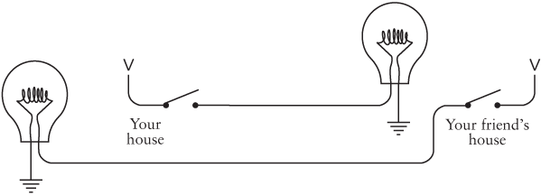

# Code: The Hidden Language of Computer Hardware and Software

Charles Petzold

## Table of Contents

## 0. About

Amazon [link](https://www.amazon.com/Code-Language-Computer-Hardware-Software/dp/0735611319/ref=sr_1_1?crid=3VV2SRGGH0GCR&keywords=code+the+hidden+language+of+computer+hardware+and+software&qid=1575792007&sprefix=code+the+hidd%2Caps%2C283&sr=8-1)

O'Reilly Learning [link](https://learning.oreilly.com/library/view/code-the-hidden/9780735634688/)

Goodreads [link](https://www.goodreads.com/book/show/44882.Code)

## 1. Morse Code

Dots and dashes. Good for flashing a light; there are even special flashlights for Morse code, to make it easier. Even better for telegraph systems (see later chapters).

S.O.S. - simplest morse code (`... --- ...`)

Morse to normal - how to organize them to make it easier to decipher:

 - tables for each possible length (from 1 to 6, 7)
 - a binary tree with each node being a possible simbol

Samuel Morse (1791 - 1872) [wikipedia](https://en.wikipedia.org/wiki/Samuel_Morse)

## 2. Braille

Louis Braille (around 1800 - 1850). 

Started from a writing system used in the military to pass around messages and enhanced it.

Each symbol is a 2 by 3 matrix of possibly raised dots. 64 symbols. Grade 2 braille uses besides the letters, other codes for either common words or groups of letters.

*Shift codes* are when a symbol changes the meaning of the followig symbols. *Escape code* is escaping the following symbol (chaging its meaning).

Braille code is a good example of how symbols are chosen to make them easier to remember. For example, some symbols are represented by a patter in the upper half of the matrix, while associated symbols are represented by the same pattern, but in the lower half.

## 3. Electricity: Anatomy of a Flashlight

Eletricity - flow of electrons. 

Atom - protons, neutrons, electrons. Number of protons gives the atomic number. Electrons usually match protons. Flow of electricity - electrons moving from one atom to another.

Charge: protons, `+` / electrons, `-`.

Batteries contain chemical reactions that push more electrons towards the `-` (anode), less towards the `+` (catode). These chemical reactions take place if there is a circuit from minus to plus. Batteries in series: increased voltage. In parallel, same voltage, more battery time.

Conductors - only one electron in the outer shell. Best: copper, silver, gold.
Opposite: insulators (plastic, rubber) - high resistance (measured in ohms).

*Note*: the thicker the wire, the less resistance (more electrons available to flow).

Voltage - a potential. Current - number of electrons flowing (amps). Like pressure and amount of water, respectively. 

  `I = E / R`

E - voltage, electromotive force.

Short-circuit - connect plus to minus, (virtually) no resistance, so a high current. If battery is large, wire might melt.

A resistor glows if it is thin. This is how the *incadescent bulb* works. Filament made of tungsten, in a vacuum (in open air it would burn up).

Watt is a mesure of power.

  `P = E x I`

A switch allows electricity to flow when it is *on*, or *closed*.

This chapter explained the decomposition of a flashlight (used for face to face morse code) into its basic elctrical circuit elements.

Volta - 1800 fist battery
Edison - 1878 incadescent lightbulb (patent), other inventors were also working on this

# 4. Seeing Around Corners

This chapters shows how you can extend the circuit for a flashlight, or two, to communicate around corners (out of sight), by creating a kind of lightbulb based telegraph system.

Wires can be reduced if the negative sides of the batteries are connected together (*common*). And that common part could even be replaced with an omnipresnet conductor, the Earth (aka ground): stick an 8 pole copper pole into the earth. However, ther Earth has more resistance, so voltage has to be increased (1.5 v batteries to 120 household) and bulbs with more resistance used (normal lightbulbs, not flashlight bulbs). 

Still, this early telegraph system has its limits: the distance of the wires. The longer the wires, the bigger the resistance, no matter how thick, and expensive, the wires.

