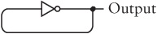

# Code: The Hidden Language of Computer Hardware and Software

Charles Petzold

## Table of Contents

## 0. About

Amazon [link](https://www.amazon.com/Code-Language-Computer-Hardware-Software/dp/0735611319/ref=sr_1_1?crid=3VV2SRGGH0GCR&keywords=code+the+hidden+language+of+computer+hardware+and+software&qid=1575792007&sprefix=code+the+hidd%2Caps%2C283&sr=8-1)

O'Reilly Learning [link](https://learning.oreilly.com/library/view/code-the-hidden/9780735634688/)

Goodreads [link](https://www.goodreads.com/book/show/44882.Code)

## 1-2. Morse Code

Dots and dashes. Good for flashing a light; there are even special flashlights for Morse code, to make it easier. Even better for telegraph systems (see later chapters).

S.O.S. - simplest morse code (`... --- ...`)

Morse to normal - how to organize them to make it easier to decipher:

 - tables for each possible length (from 1 to 6, 7)
 - a binary tree with each node being a possible simbol

Samuel Morse (1791 - 1872) [wikipedia](https://en.wikipedia.org/wiki/Samuel_Morse)


## 3. Braille

Louis Braille (around 1800 - 1850). 

Started from a writing system used in the military to pass around messages and enhanced it.

Each symbol is a 2 by 3 matrix of possibly raised dots. 64 symbols. Grade 2 braille uses besides the letters, other codes for either common words or groups of letters.

*Shift codes* are when a symbol changes the meaning of the followig symbols. *Escape code* is escaping the following symbol (chaging its meaning).

Braille code is a good example of how symbols are chosen to make them easier to remember. For example, some symbols are represented by a patter in the upper half of the matrix, while associated symbols are represented by the same pattern, but in the lower half.


## 4. Electricity: Anatomy of a Flashlight

Eletricity - flow of electrons. 

Atom - protons, neutrons, electrons. Number of protons gives the atomic number. Electrons usually match protons. Flow of electricity - electrons moving from one atom to another.

Charge: protons, `+` / electrons, `-`.

Batteries contain chemical reactions that push more electrons towards the `-` (anode), less towards the `+` (catode). These chemical reactions take place if there is a circuit from minus to plus. Batteries in series: increased voltage.


In parallel, same voltage, more battery time.


Conductors - only one electron in the outer shell. Best: copper, silver, gold.
Opposite: insulators (plastic, rubber) - high resistance (measured in ohms).

*Note*: the thicker the wire, the less resistance (more electrons available to flow).

Voltage - a potential. Current - number of electrons flowing (amps). Like pressure and amount of water, respectively. 

  `I = E / R`

E - voltage, electromotive force.

Short-circuit - connect plus to minus, (virtually) no resistance, so a high current. If battery is large, wire might melt.

A resistor glows if it is thin. This is how the *incadescent bulb* works. Filament made of tungsten, in a vacuum (in open air it would burn up).

Watt is a mesure of power.

  `P = E x I`

A switch allows electricity to flow when it is *on*, or *closed*.

This chapter explained the decomposition of a flashlight (used for face to face morse code) into its basic elctrical circuit elements.

Volta - 1800 fist battery
Edison - 1878 incadescent lightbulb (patent), other inventors were also working on this

## 5. Seeing Around Corners

This chapters shows how you can extend the circuit for a flashlight, or two, to communicate around corners (out of sight), by creating a kind of lightbulb based telegraph system.

Wires can be reduced if the negative sides of the batteries are connected together (*common*). And that common part could even be replaced with an omnipresnet conductor, the Earth (aka ground): stick an 8 pole copper pole into the earth. However, ther Earth has more resistance, so voltage has to be increased (1.5 v batteries to 120 household) and bulbs with more resistance used (normal lightbulbs, not flashlight bulbs). 

Still, this early telegraph system has its limits: the distance of the wires. The longer the wires, the bigger the resistance, no matter how thick (and expensive) the wires.


## 6. Telegraphs and Relays

Morse invented the telegraph in 1836. It was based on electromagnetism - a long wire wrapped many times around a metal bar. Passing current made the metal attract other metals. A proper lightbulb came around in 1878, so that was not an option. Sound was the option (the electromagnet pulls down a flexible piece of metal which was then pulled back - *click clack*).

The distance problem mentioned in the previous chapter was solved by repeatears. The destination end was replaced with a *relay*, basically a switch that was activated by current. The electromagnet pulls a flexible strip of metal that closes the outgoing circuit.

This relay is an important step in the upcoming computers.


## 7. Our Ten Digits

Numbers are the most abstract code that we have. Probably invented to keep track of merchandise. Based on your ten fingers (or digits).

Roman system is probably the only ancient system that survives. It is easy to add and subtract, but not to multiply and divide.

Out decimal system is hindu-arabic. Invented in India and brought to Europe by the Arabs (around 1100). The biggest differences are the fact that it is positional (the position of a digit matters) and it has a dedicated symbol for 0.

The positions, even fractional, represent power of 10. Operations come down to operations on pairs of single digits pairs 

## 8. Alternatives to Ten

A cartoon character has 8 fingers, so what does 9, or even 8, as symbols mean to him? 

In a positional numbering system, 10 (one zero) is the representation of the "number of fingers". The addition and multiplication tables for sIngle digits change, but the rest of the rules remain.

In octal, a nice round number is a power of two because it is a multiplication with a power of 8 (which is a power of two).


Going down, a dolphin can only count with 0 and 1. Binary. The numbers are longer, but the addition and multiplication tables are much smaller, faster.

0 and 1 - current through a wire, switch on off, lightbulb on off

The term *bit* was coined in the 1940s for a shorter form of binaty digit. (Tukey - mathematician - 1948).

## 9. Bit by Bit by Bit

The bit is a special numbering system because it is just a yes or no. But with enough bits, any information can be encoded.

The UPC (universal product code) is a good example of a real, production code

 - a thin bar is a 1, a thin gap is a 0; bars can be 2 3 4 times thicker; gaps the same
 - thin bar 1, thin gap 0 - 95 bits (plus 9 extra gaps, aka 0 bits, on either side)
 - starts and ends with the marker 101 - this allows for the scanner to calibrate and know how thin is the thin bar (and the gap). Also allows it to be read from right to left as well
 - in the center it has a specific center pattern, a *guard pattern*. If not found, malformed or misread (*error detection*)
 - the left side encodes 6 digits, the right side the same
 - 7 bits are used for each digit. On the left side, a digit code always starts with a 0 and ends with a 1 (format guard, error detection); 2 groups of one, so two vertical bars per digit; odd number of 1 bits - odd parity
 - right side is the exact opposite (binary negative); so parity is even; this allows to know whether you are reading from right to left

So, a lot of extra bits (over 100) for a "simple" 12 digit code.

The first digit has a meaning (regular code, has to be weighed, coupons etc). Next 5 digits represent the company id, next 5 product id. Last digit is modulo check character (`n*10 - 3 * (sum(first 5 digits)) - sum(second 5 digits)`). Again, integrity, error check.


Morse and braille also can be encoded into binary.

## 10. Logic and Switches

Ancient greeks considered analyzing logic in language to help in the search of truth (4th cent bc). Eg: syllogism - drawing a conclusion from two premises.

George Bool, around 1850, transformed logic into mathematic - boolean algebra. The operands are sets, or classes and the operators are union, intersection. Using it you can prove a syllogism, for example. (All men are mortal, Socrates is a man, Socrates is mortal).

The numbers 1 and 0 can be used to represent yes and no as satisfying criterias of being in a class or not. *Or* and *and* operators can help with complex selection criterias.

But what if you transform 1 and 0 into a switch, open or closed, and *or* and *and* into switches in parallel and in series. Then, if the circuit closes (telegraph relay rings for eg), you made the connection between boolean logic and electronics. Like the selection of a cat based on a set of specific criterias (sex, color, neutered).


Nobody made this connection in the 19th century, not even Babbage, credited to invent the precursor to modern computers using gears and levers.

## 11. Gates

Shannon (1930s) who wrote about the theory of communication made the connection between switches, or even better, relays, and boolean algebra.

A relay has an input and an output. A combination of relays is a logical gate.

 - And
 - Or
 - Inverter
 - Nor
 - Nand
 - Buffer
 - 2 to 4 line decoder (2 inputs, one of 4 outputs trggered)

Below is an AND gate made out of two relays.


De Morgan worked on boolean algebra in the same time as Bool. De Morgan's laws: negation of operands is the negation of the result of the other operation.

## 12. A Binary Adding Machine

8 bit adder

Start with adding 1 bit, you have a sum and a carry out. Carry out is an AND gate; the sum is a new gate, an XOR gate (OR gate, NAND gate, both in an AND gate). This is a half adder, as it does not take a carry in. With two half adders, the second one to treat the carry in, and an OR gate, you have a full adder for one bit with carry in and out.

Cascade 8 of them and you have an 8 bit adder. Cascade two of these and you can add 16 bit numbers.


This 8 bit adder uses 144 relays.

It is a ripple carry. More efficient but more complex adder is a lookahead adder.

Computers were first made with relays, then with vacuum tubes, now with transistors.

## 13. What About Subtraction

The logic of subtraction, of borrowing, is not as straightforwatd as addition. You could use the 9s complement (subtract from all 9s) to avoid borrowing, but you still need a subtraction at the end. Note: one's complement is easier to calculate as it turns out to be an inverse of the bits.

E.g. of subtraction without borrowing, using nines' complement: 

```
    253 - 176 = ?

	253 - 176 + 1000 - 1000 = 
    253 + (999 - 176) + 1 - 1000 = 77
```

To represent negative numbers, what if you knew what range of numbers you have and use the upper range of positive numbers to represent the negative ones. Eg: 128 is -128, 255 is -1, 0 is 0, 1 is 1, 254 is 254. Now you can just use addition for any numbers. Only thing is to take care of overflows and underflows, considering the sign bits of the two operands and of the result.

This representation is 2's complement (to calculate: one's complement (inverse) and then add one 1; back it is the same way).

## 14. Feedback and Flip-Flops

Using an inverter (relay based) connected back to itself, you get an oscillator, a circuit that quickly alternates between 1 and 0. With a switch, that can make an electric bell or buzzer.

Without the switch, you have an oscillator. The oscillator's changes start without any human intervention. Output is a clock diagram. Cycle is the time between a change in output and then back - duration depends on how the relay is built (period). Frequency is 1/period (cycles per second, hertz).

Hertz (1856 - 1894) was the first person to transmit and receive radio waves. First used in germany 1920s.



Two NOR gates with a feedback loop creates a special circuit, one that has two stable states - a flip-flop. Reset-Set flip-flop with outputs Q and Q-bar. When "set" is 1, Q is 1. When both inputs are 0, it holds the previous outputs, it remembers. "R-S flip-flop" reset set.


If we want to save the state (lets say "data") at a particular point in time (when we activate a "hold that bit" signal), we add two AND gates to the two reset and set (with the hold). Also we can make the reset the inverse of the set since we care only about holding the change, not when both are 0. Set is now "data". We have a level-trigerred D-type flip-flop, or latch (latches on to one bit of data and keeps it). The hold signal is usually labelled clock. Level-trigerred because it holds data when that signal is at a particular level. (D stands for data). 1 bit memory!!


Adding an OR gate with a clear signal on the reset input lets you clear the latch.

8bit adder with latches pg 170


Edge triggered flip flop takes the value data only when the clk changes from 0 to 1, so it may be preferred to avoid changes in data. This is built with two stages of R-S flipflops with the clock inversed for the first of them (pg 171). Basically the first stage acts like a buffer of the data value, and when the clock changes from 0 to 1, the second stage will show the stored data (which can now change, as it does not matter).

Symbol: arrow pointing up in the truth table and a small angle bracket in the diagram.


An oscillator with an edge trigerred flipflop with Qbar connected to Data input makes a frequency divider. The outputs Q and Q bar change on every cycle of the clock (half the frequency). Note that the relays in the oscillator must be much slower than the rest of the relays, so they can keep up.

If you string 8 of these together you get a ripple counter (counts 8 bit numbers). (Pg 176). When all output are 0 again it has gone through 256 cycles, so with measuring the time you have the frequency of the initual oscillator.


A flipflop with an extra preset input will make Q 1 when preset is set. And an extra clear input will makeit 0 (preset and clear should bot be 1 at the same time).


## 15. Bytes and Hex

Byte - 1960s ibm's system/360 computer - group of 8 bits. Enough for most alphabets, grayscale photographs (256 shades of gray distinguished by the human eye). Storage format for numbers: BCD, binary coded-decimal (later).

Nibble - half a byte.

A byte is quite long in binary. In octal it is shorter (from 000 to 377), so an octal representation of a 16 bit is not the same as the representation of the two bytes. Base 16 fits better - groups of 4.


